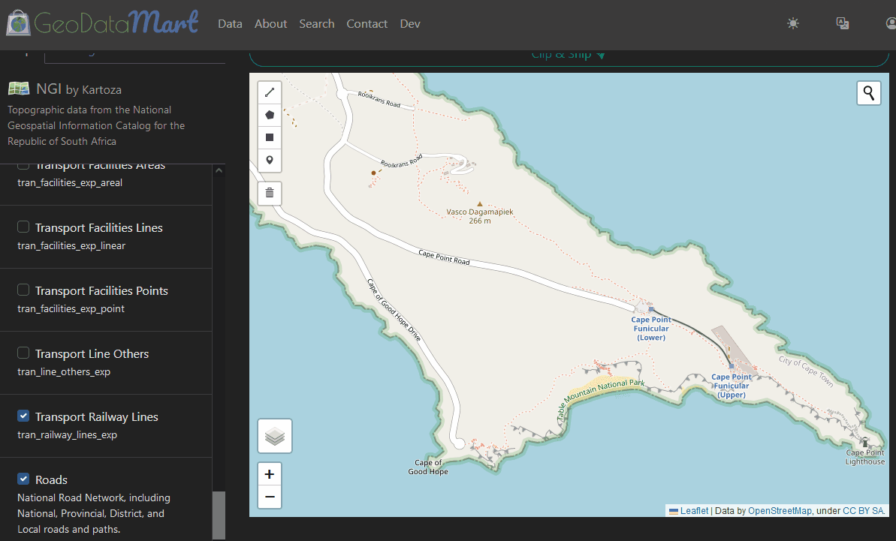

# Geodata Mart

Search, select, clip, and deliver spatial data sources.

[https://data.kartoza.com](http://data.kartoza.com)



## Run

The development stack is managed with Docker Compose.

Spin up development environment

```bash
cp .env.example .env
docker compose up -d --build
```

Bring down the stack

```bash
docker compose down -v
```

### Running commands

Because the django app is run within an isolated docker container and may not have access to the declared environment variables for the project, from within a container run the provided helper script to configure the environments:

```bash
source /app/setenv.sh
```

Once this script has run and defined the environment, running django commands may proceed as normal.

```bash
python /app/manage.py shell
```

Using the docker extension with vscode along with the `docker.commands.attach` command available from the supplied settings.json file will automatically run this script when attaching a shell to a container.

## Deploy

Deployment is done with docker compose (for now).

Some notes/ caveats on the 0.1 release deployment:

- run docker compose with root level perms: otherwise running and creating users on postgresql may fail
- lowercase for postgresql user: if you generate a random username make sure everything is cast to lowercase
- file permissions issues: celery workers need to be run as root (for now) due to the qgis config and local user config not being 100%. As a result, the geodata/ qgis directory needs to probably be owned by root and have 777 permissions, due to django etc running under the django user. This may also cause issues with data removal from the admin ui in django
- cascading reference removal: many foreign key fields relate to managed file objects, which include lifecycle hooks for keeping the filesystem and the db models in some sort of sync. There's a bug there that causes an error on cascading, so the default for most fk in architecture/ conception phase was "do nothing". This is also used for accounts etc for which the lifecycle is not yet defined. This needs review and reevaluation, as for now even removing users may result in a meaningless "500/ Oops" error, because accounts and all other related items need to be removed first. Same goes for projects etc.
- docker logging config: it's the default atm and will likely cause system bloat

## Adding projects

There's a bit of a serious bug with regard to adding new project and config items... When developing/ iterating over the schema structure and what fields or requirements needed to be put into the system, the fk field was defined on the project, and then that related to the managed file objects. When the change was implemented to use dynamic file paths based on project details, it became possible to associate a file with the project and when calling save() (as demonstrated in the seed operation) the file would be uploaded to the project path. This keeps relative paths intact and prevents collisions.

The problem is that this is not exposed through the admin ui, as when uploading a config file it is not possible to specify the reverse relation to the project in order to get the dynamic file path. I thought there may be a clever hack but I haven't been able to find anything and it seems like a schema restructure is a better option, but it's a bit late in the day for that to enter the deployment, so new project definitions will have to be managed programmatically for the time being or have auxiliary files placed in the relevant geodata root directory.

## Development

Development and stack is managed using docker. Note that their are multiple "environments" for the application development, including:

- Local development environment: This is a python environment that includes prerequisites such as precommit, black, and other linting/ testing/ code quality tools. This can be the system environment, but using a venv is recommended.
- Development environment: The requirements dev.txt is used by the dev Dockerfile, which is a Django environment with a number of development and debug tools. This is the docker-compose stack environment used for development
- Production environment: The requirements production.txt is used by the production Dockerfile, which is a Django environment intended to be pushed to a container repository, and deployed with kubernetes.
- On windows, add `FORKED_BY_MULTIPROCESSING=1` to your `.env` to prevent the celery worker from failing

### Prerequisites

Development systems should have:

- git
- precommit
- editorconfig
- python 3.8

### Dev environment venv creation

```bash
python -m venv venv
venv/bin/activate
python -m pip install -e .[dev]
```

### Framework

This application was modified from cookiecutter-django, and the [project docs](https://cookiecutter-django.readthedocs.io/en/latest/) may be helpful to developers.

### Settings

It is desirable to aim for [dev-prod-parity](https://12factor.net/dev-prod-parity). The `production.py` settings exclude many functions from `dev.py`, such as debug and dev tools and a change in email service configuration. The `frontend.py` settings replicate `dev`, but disable white noise and the offline caching of django-compressor to allow more dynamic loading and modification of frontend assets without having to restart the stack.

Note that changes to the celery tasks etc. will require you to rerun the docker build function before your changes are reflected in the tasks and scripts.
